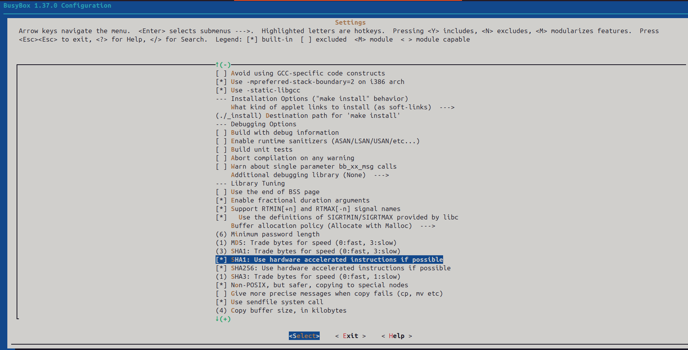

# Build ARM toolchain
```
$ sudo apt install gcc-aarch64-linux-gnu
Reading package lists... Done
Building dependency tree... Done
Reading state information... Done
gcc-aarch64-linux-gnu is already the newest version (4:13.2.0-7ubuntu1).
0 upgraded, 0 newly installed, 0 to remove and 24 not upgraded.
```

# Export Project Setting
Modify WORK_DIR to your preferred path.
```
export WORK_DIR=/home/xenonarm 
export BUILD_DIR=${WORK_DIR}/build 

mkdir -pv $WORK_DIR
mkdir -pv $BUILD_DIR/busybox_arm64
```

# Get Busybox
```
cd $WORK_DIR
wget -c https://www.busybox.net/downloads/busybox-1.37.0.tar.bz2 
tar xf busybox-1.37.0.tar.bz2
```

# Build Busybox
```
cd $WORK_DIR/busybox-1.37.0/
make 0=$BUILD_DIR/busybox_arm64/ ARCH=arm CROSS_COMPILE=aarch64-linux-gnu- defconfig
make 0=$BUILD_DIR/busybox_arm64/ ARCH=arm CROSS_COMPILE=aarch64-linux-gnu- menuconfig
```
### Complied as a static library
```
cat 'CONFIG_STATIC=y'>>.config
```

### Disable TC support
the kernel has removed support for CBQ. Which is used by tc. You need to disable it by editing the .config file in source directory.
```
sed -i 's/CONFIG_TC=y/CONFIG_TC=n/' .config
```

Or you will get error like this:
```
networking/tc.c: In function ‘cbq_print_opt’:
networking/tc.c:236:27: error: ‘TCA_CBQ_MAX’ undeclared (first use in this function); did you mean ‘TCA_CBS_MAX’?
  236 |         struct rtattr *tb[TCA_CBQ_MAX+1];
      |                           ^~~~~~~~~~~
      |                           TCA_CBS_MAX
```

## Disable HW ACC
```
sed -i 's/CONFIG_SHA1_HWACCEL=y/CONFIG_SHA1_HWACCEL=n/' .config
sed -i 's/CONFIG_SHA256_HWACCEL=y/CONFIG_SHA256_HWACCEL=n/' .config
```
Alternative can be done from the MENU config. 



## Make build and install
```
make -j2 0=$BUILD_DIR/busybox_arm64/ ARCH=arm64 CROSS_COMPILE=aarch64-linux-gnu-

make install  0=$BUILD_DIR/busybox_arm64/ ARCH=arm64 CROSS_COMPILE=aarch64-linux-gnu-
```

## You should see something like this
```
  ./_install//usr/sbin/ubirename -> ../../bin/busybox
  ./_install//usr/sbin/ubirmvol -> ../../bin/busybox
  ./_install//usr/sbin/ubirsvol -> ../../bin/busybox
  ./_install//usr/sbin/ubiupdatevol -> ../../bin/busybox
  ./_install//usr/sbin/udhcpd -> ../../bin/busybox


--------------------------------------------------
You will probably need to make your busybox binary
setuid root to ensure all configured applets will
work properly.
--------------------------------------------------

/home/xenonarm/busybox-1.37.0$ 
```

## Create root file system
```
cd _install/
mkdir proc sys dev etc etc/init.d
cd ..
vim _install/etc/init.d/rcS
```

## Edit the rcS
```
#! /bin/sh
mount -t proc none /proc
mount -t sysfs none /sys
/sbin/mdev -s
```

## Make root fs executable
```
chmod +x _install/etc/init.d/rcS
```
## Create rootfs image
```
cd _install
find . | cpio -o --format=newc > ../rootfs.img
cd ..
gzip -c rootfs.img > rootfs.img.gz
```

## Copy root fs to distinct folder
```
cp rootfs.img.gz $BUILD_DIR/busybox_arm64/
```

## Let's take a look what's the root FS structured.
```
/home/xenonarm/busybox-1.37.0$ ls -l _install/
total 28
drwxrwxr-x 2 root root 4096 Oct  8 21:40 bin
drwxrwxr-x 2 root root 4096 Oct  8 21:46 dev
drwxrwxr-x 3 root root 4096 Oct  8 21:46 etc
lrwxrwxrwx 1 root root   11 Oct  8 21:40 linuxrc -> bin/busybox
drwxrwxr-x 2 root root 4096 Oct  8 21:46 proc
drwxrwxr-x 2 root root 4096 Oct  8 21:40 sbin
drwxrwxr-x 2 root root 4096 Oct  8 21:46 sys
drwxrwxr-x 4 root root 4096 Oct  8 21:40 usr
```