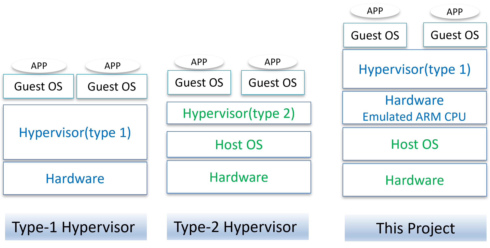

# Emulate ARM TrustZone on a Virtual Machine
Emulating Virtualized ARM TrustZone on a Xen Hypervisor in an x86 Environment

The key software components used in our implementation include:
• OP-TEE: Version 4.3.0
• Xen: Version 4.18.3
• QEMU: Version 9.1.0
• BusyBox: Version 1.37.0
• Linux Kernel: Version 6.1.18

QEMU_XEN_Uboot_Linux_Approach: An updated version based on [Medium Article on Xen and OP-TEE](https://medium.com/@denisobrezkov/xen-on-arm-and-qemu-1654f24dea75)

OPTEE_Approach: OP-TEE offers `make` project to build the stack.

