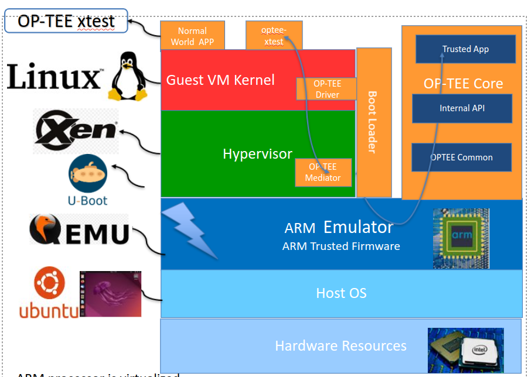

# Emulate ARM TrustZone on a Virtual Machine

QEMU_XEN_Uboot_Linux_Approach: An updated version based on [Medium Article on Xen and OP-TEE](https://medium.com/@denisobrezkov/xen-on-arm-and-qemu-1654f24dea75)

OPTEE_Approach: OP-TEE offers `make` project to build the stack.

